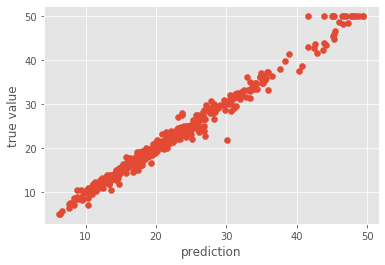

# Decision Trees Assignment
The first part of the exercise had us implement a random forest model from scratch, which was then optimized (through minimizing the OOB MSE) on the boston-housing dataset (sklearn):

In the second part we imported sklearn's implementations of a decision tree and random forest classifiers, optimized their performance through hyperparameter optimization (e.g. criterion, max depth and max features) on the MNIST digit classification task.

