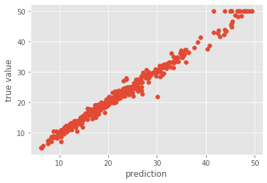
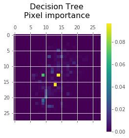
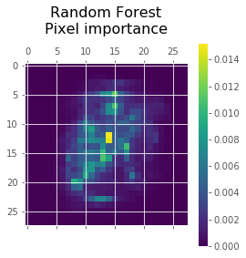

# Decision Trees Assignment

The first part of the exercise had us implement a random forest model from scratch, which was then optimized (through minimizing the Out-Of-Bag MSE) on the boston-housing dataset (from sklearn):

In the second part we imported sklearn's implementations of a decision tree and random forest classifiers, optimized their performance through hyperparameter optimization (e.g. criterion, max depth and max features) on the MNIST digit classification task, and tested their optimized performance on a test set.

We then compared their performance in terms of accuracy, class probability of corrected and incorrectly classified test samples, and by looking at the pixel importance map, i.e., which pixles (features) and the most important in the classification task on this set:

