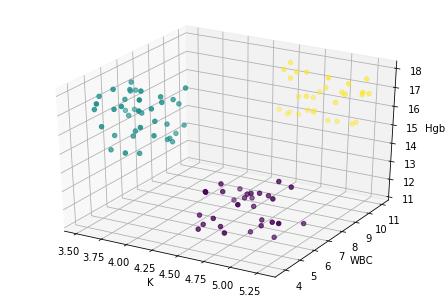
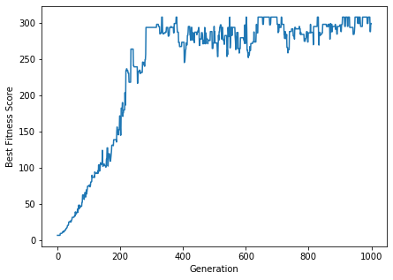

# Genetic Algorithms Assignment

In this assignment we played around with simple genetic algorithms (GAs), designed and tuned fitness functions, biased selections, recombinations and mutations.

## Part 1: Time Series of 'Likes' Influenced by Personalization

We improved upon a simple GA that solves for a user-engagement prediction model, by trying to reach the analytically solved polynomial coefficients.

## Part 2: Solving Different Problems With the Same GA

Here, we were asked to solve a clustering problem of EMR blood-test data. The reference solution using K-Means showed good clustering using K = 3:

However, K-Means requires the number of clusters 'K' to be pre-defined.

Using a GA, we can find a simlar solution without prior assumptions regarding the number of clusters:

