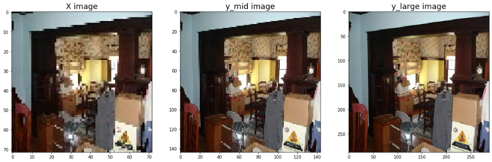
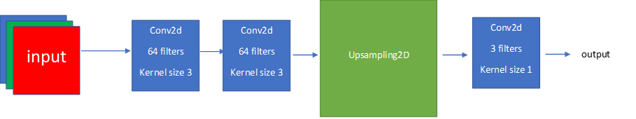
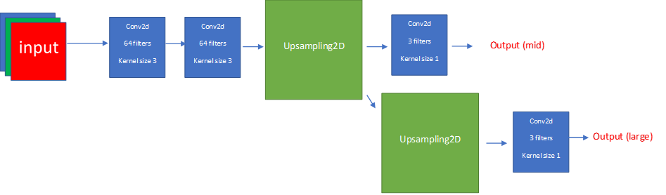
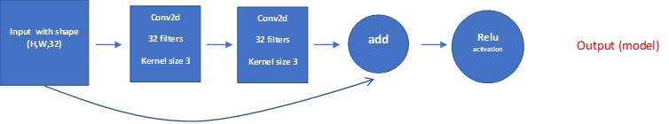
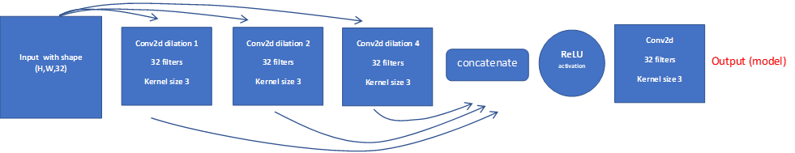
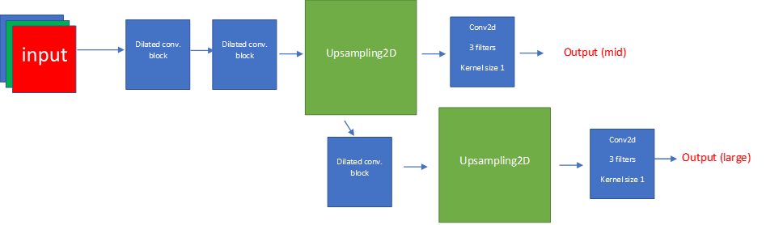
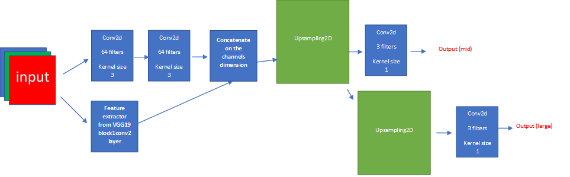
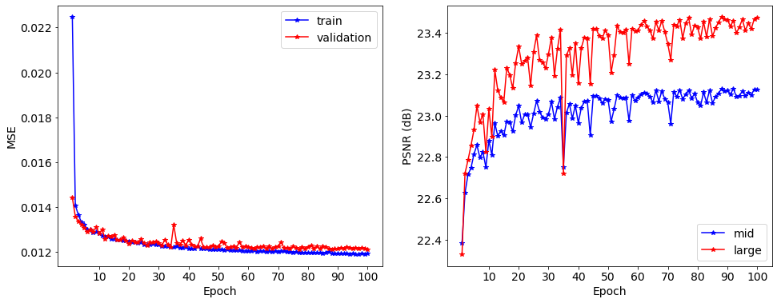
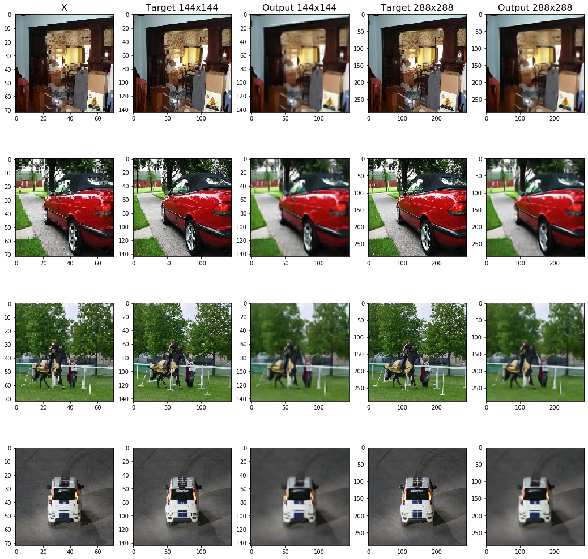

# Super Resolution (Deep Learning) Assignment

The purpose of this assignment was to get familiar with the construction and training of fully convolutional networks (FCNs) through the task of image super-resolution. The task entailed constructing several different architectures and comparing their results.

For this self-supervised learning task we used the PascalVOC 2007 dataset.

## Step 1 - Creating the dataset

The first task was to create a dataset and a data-loader for images of 3 different sizes:

X - 72x72x3
y_mid - 144x144x3
y_large - 288x288x3

An example of an image in all 3 sizes:

## Step 2 - Baseline model

Create a baseline model (named BaseNet) that outputs only a y_mid sized image. The model has the following architecture:

## Step 3 - Multiple outputs

Add a module to BaseNet which outputs a y_large image. This network combines the loss of the mid and large outputs for the training phase:

## Step 4 - Residual blocks

Here, we replaced the regular convolution layers with residual blocks:

to give ResidualNet:

## Step 5 - Dilated (Atrous) convolution blocks

We once again replaced the regular convolution layers with dilated convolution blocks:

to give DilatedNet:

## Step 6 - Pre-trained network

In the final step, we were asked to make use of a pre-trained network (I chose VGG19) as a feature extractor to be added to our own network's features. We use only the first two convolution layers from the VGG19 model:

## Results and conclusion

The loss function was chosen to be the MSE, however, for the assessment of the quality of image reconstruction, we also calculated the Peak Signal-to-Noise Ratio ([PSNR](https://en.wikipedia.org/wiki/Peak_signal-to-noise_ratio)), which is a function of the MSE.

Below are plots of the train and validation loss, as well as the PSNR, for the DilatedNet:

And a few examples of the target images and their reconstructions:

The following table summarizes the maximum PSNR achieved for all networks for mid and large sized targets:

| Network       | Mid PSNR  | Large PSNR
| ------------- | --------- | ----------
| BaseNet       | 23.03     | 23.18
| MidLargeNet   | 23.04     | 23.18
| ResidualNet   | 23.12     | 23.45
| DilatedNet    | **23.13** | **23.47**
| PreTrainedNet | 23.03     | 23.17

We can see that the nets using dilated convolution blocks and residual blocks show similar performance, better than the rest, including the net using a pre-trained feature extractor.

The worse performance of the pre-trained net is probably due to the lack of more sophisticated convolution blocks (as in ResidualNet and DilatedNet). In addition, there is a differences between the contents of the image datasets used in ImageNet (used to train VGG19) and the one used here (PASCAL VOC 2007).

Regardless, this exercise shows that the use of more complex block models indeed improves performance over simpler architectures.
