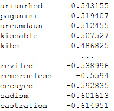

# Word Embedding Assignment

In this exercise we used word vectors trained on a corpus of 380,000 lyrics of songs from MetroLyrics. We used the Word2Vec model from the [gensim](https://radimrehurek.com/gensim/models/word2vec.html) package, and followed a well written [tutorial](https://www.kaggle.com/pierremegret/gensim-word2vec-tutorial) as a reference.

## Pre-processing

The first step was to pre-process the lyrics, which included tokenization of words, transforming to lowercase letters and removal of punctuation marks, rare words and stop words. The clean lyrics are then arranged as a list of words.

## Model training

Then, the model vocabulary is built, followed by the training. The trained model can be evaluated by reviewing most similar words in the embedding space:

And also word-vector algebra:

## Sentiment analysis

In this section, we estimated the sentiment of words using word vectors. First, we trained a classifier on the 'SemEval-2015 English Twitter Sentiment Lexicon' dataset, for predicting sentiment (a score ranging from -1 to 1) given the word vector. We then used the classifier to predict the sentiment score of words in the lyrics corpus that were not used in the training of the classifier:

The results make sense on the negative side of the scores, however they seem weird at first looking at the positive words. After a quick search, the word 'areumdaun' actually means 'beautiful' in korean :)

## Visualize word vectors

We then plotted the 'most significant' words from each genre by reducing their dimensions from 300 to 2 using PCA and tSNE:

Although no clustering by genre is visible, there do seem to be clusters of similar words.

## Text classification

In this section we compared the performance of a bag-of-words based text classifier with one based on word vectors.

A naive bayes classifier was chosen for the bag-of-words approach, which yielded rather poor results, although the confusion matrix revealed that the most distinguishable genres in terms of lyrics are hip-hop and rock.

For the word vectors, two methods were used to train a random forest classifier. The first is creating an average word vector for each song. The second does the same, but also weighs each word vector by its corresponding word tf-idf score.

The performance of both, while still leaving room for improvement, perform considerably better than the bag-of-words based approach.
